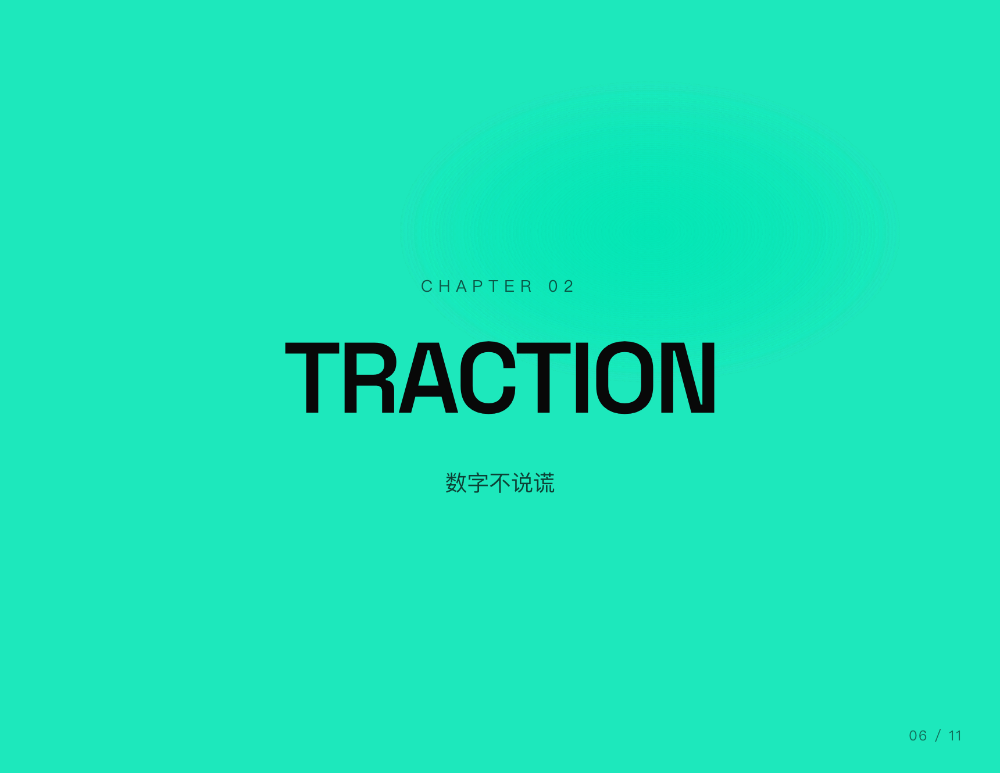
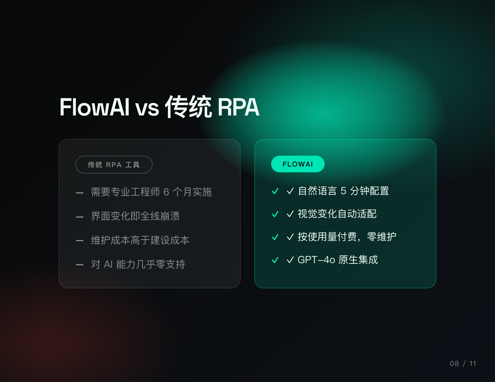
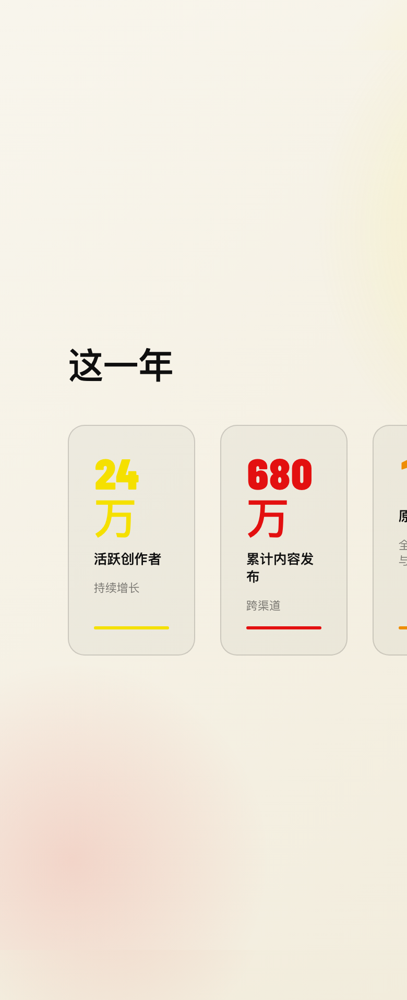
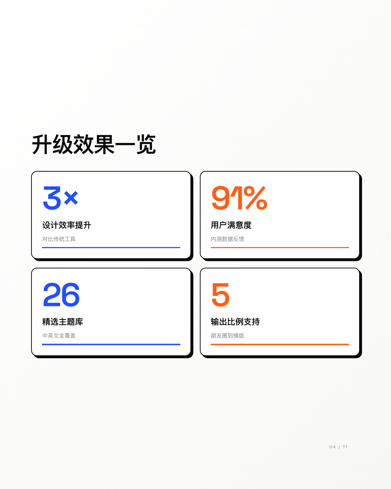
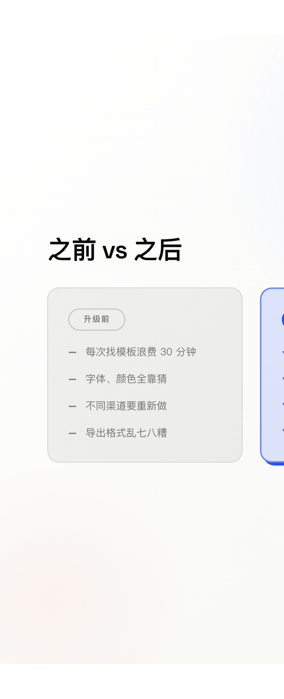
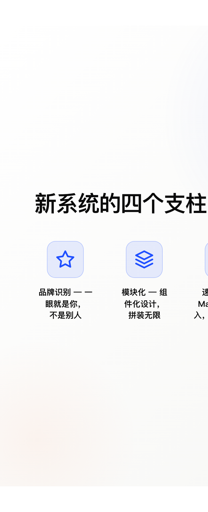
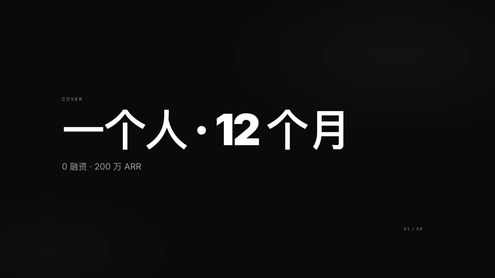
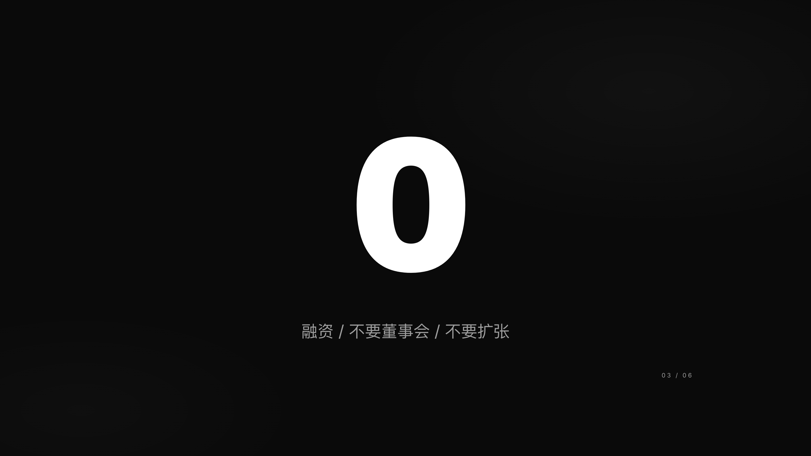
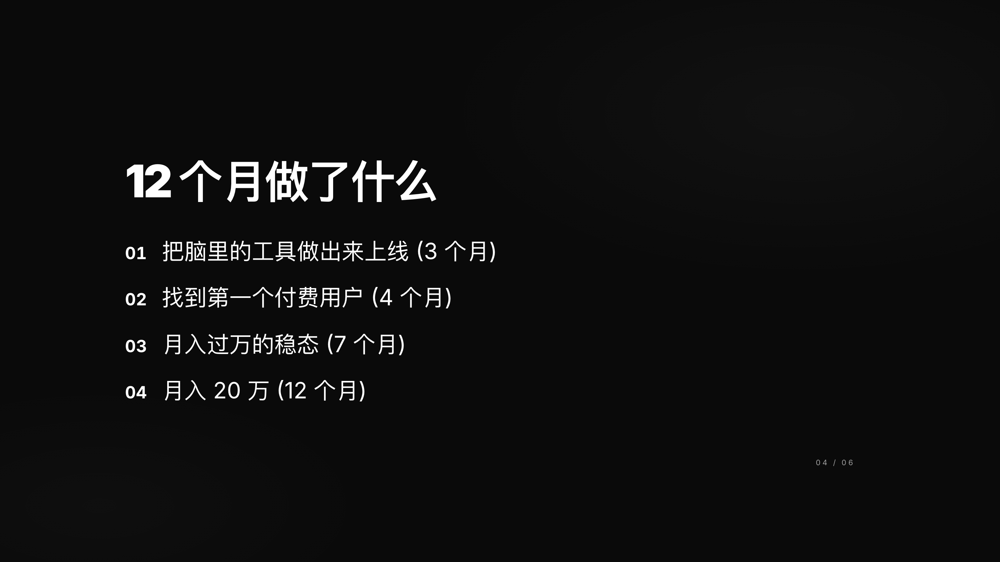

<div align="center">

# SY-PPT-templates · 十页 Deck

**Markdown → Beautiful Presentation · One File**

[](LICENSE)
[](src/themes)
[](AGENTS.md)
[](AGENTS.md)

[🇨🇳 中文](README.md) · [🇺🇸 English](README.en.md)

---

**Paste Markdown → Pick a theme → Export HTML → Share anywhere**

No account · No watermark · No cloud · Fully open source

</div>

---

## What is this?

A Markdown-to-presentation tool with **26 curated themes** — 14 built for Chinese local scenarios that mainstream tools (Gamma, Beautiful.ai) mostly ignore.

You write content. It handles the design.

| Output | What it is | How to use |
|---|---|---|
| 📄 **Single-file HTML** | One `.html` file, keyboard navigation, animations | Share via email or chat — double-click to open; or project it |
| 🖼️ **Card ZIP** | One PNG per slide | Post directly to Xiaohongshu / WeChat Moments / Instagram |

**No subscription. No cloud. Install once, use forever.**

---

## Two Ways to Use It

### Option 1: Browser Editor (for hands-on users)

```bash
pnpm install
pnpm dev
```

Open `http://localhost:5173`:

```
┌─────────────────────────────────────────┐
│  Left:  Paste your Markdown content     │
│  Right: Live preview                    │
│  Top-right: Theme / Ratio / Export      │
└─────────────────────────────────────────┘
```

1. Paste your content on the left
2. Pick a theme (26 options)
3. Click "Download HTML" → send to anyone — they just double-click

### Option 2: AI Agent (zero setup)

**No installation needed.** Paste this to your AI coding tool (Claude Code / Cursor / Cline / etc.):

> Help me make a presentation.
> Clone https://github.com/Shiye-10Pages/SY-PPT-templates,
> follow the instructions in AGENTS.md,
> pick the best template from index.json,
> and generate a single-file HTML I can double-click to open.

The agent will automatically:
- Read the operating manual → pick the best theme → write content → generate HTML → hand you the file path

---

## Gallery

---

### ⚡ Neon Pulse — Tech Launch / Indie Dev / Hackathon

 

  

> Pure black × electric mint × hot coral. Scanline texture + cursor-follow glow. Chapter slides flood the screen in vivid green. Big number pop-in animation.

---

### ☀️ Solar Blast — Brand Manifesto / Event Poster / Launch

 

  

> Cream paper × electric yellow × ultra red. Barlow Condensed 900w. Chapter slides explode in full-screen yellow. Poster-grade visual impact.

---

### 🎨 Chroma Pop — Brand Redesign / Creative Pitch / Neo-Brutalism

 

  

> Pure white × electric blue × vivid orange. 2.5px thick black borders + 6px offset shadow. Maximum visual impact, neo-brutalist energy.

---

### 🏛️ Deep Authority — Quarterly Report / Investor Deck / Board

 


> Deep navy × warm gold × bone white. Source Serif 4 scholarly serif. Paper grain overlay. Institutional authority without the cold stiffness.

---

### 📒 Editorial Warm — Creator Year-in-Review / Personal Brand

  

> Warm parchment × brick terracotta × amber gold. Bricolage Grotesque × Instrument Serif italic. Magazine-grade editorial quality.

---

### 🍜 Restaurant Promo — Store Anniversaries / WeChat Moments

  

> Warm red × egg yellow × cream. Giant price cards with strikethrough original price + pill taglines. Built for F&B operators who don't design.

---

<details>
<summary>📸 More screenshots…</summary>

### 🍎 Keynote Dark

  

### 🚀 Solo Founder Pitch

  

### 🌸 Xiaohongshu Pastel

  

### 🔴 Government Red

  

### 📚 Book Quote

  

</details>

---

## All 26 Templates

<details>
<summary>📋 Click to expand full list</summary>

### Tier A — Chinese B2B / Enterprise (8 themes)

| Theme | Best for | Ratio | Style |
|---|---|---|---|
| 🔴 Government Red | Party briefings, public sector | 16:9 | Deep red + Songti serif |
| 🔵 SOE Navy Blue | State-owned enterprise reports | 16:9 | Navy + dark gold |
| 🍊 Restaurant Promo | Store anniversaries, WeChat Moments | 4:5 | Warm red + egg yellow |
| 🧡 Education/Tutoring | K12, tutoring centers | 4:5 | Trust orange + blue |
| 🏙️ Real Estate | Property listings, open house | 4:5 | Deep gray-blue + gold |
| 💚 Insurance/Wealth | Financial advisor, client pitches | 4:5 | Deep teal + champagne gold |
| ⚙️ Industrial | Factory reports, safety briefings | 16:9 | Graphite + engineering orange |
| 🔑 Party Class | Party education, ideological sessions | 16:9 | Party red + gold |

### Tier B — Chinese Content Creators (6 themes)

| Theme | Best for | Ratio | Style |
|---|---|---|---|
| 🌸 Xiaohongshu Pastel | Product reviews, lifestyle | 3:4 | Cherry pink + grape purple |
| 🎬 Douyin Vertical | Live stream promos, short video | 9:16 | Black + Douyin red/cyan |
| 💬 WeChat Public Hero | Article headers, banner | 2.35:1 | WeChat green + white |
| 📱 WeChat Moments | Year-in-review, long image | 4:5 | Clean white + green |
| 📖 Book Quote | Reading notes, literary sharing | 4:5 | Kraft paper + brown serif |
| 🔬 Science Pop | Explainers, knowledge cards | 4:5 | Off-white + knowledge blue |

### Tier C — General Professional (8 themes)

| Theme | Best for | Ratio | Style |
|---|---|---|---|
| 🚀 Solo Founder | Startup pitch, indie hacker | 16:9 | Pure black + white |
| 📋 Resume/Portfolio | Job hunting, freelancing | 4:5 | Off-white + single accent |
| 📝 Meeting Minutes | Team syncs, decisions | 16:9 | White + red highlights |
| 📊 Data Dashboard | KPI review, QBR | 16:9 | Dark + cyan/green |
| ✏️ Editorial Warm | Creator year-in-review, brand story | 4:5 | Parchment + brick terracotta |
| 💥 Chroma Pop | Brand redesign, creative pitch | 4:5 | White + electric blue/orange |
| 🏛️ Deep Authority | Quarterly reports, board presentations | 16:9 | Deep navy + warm gold |
| 🌺 Solar Blast | Brand manifesto, event poster | 4:5 | Cream + electric yellow + red |

### Tier D — International / Classic (3 themes)

| Theme | Best for | Ratio | Style |
|---|---|---|---|
| 🍎 Keynote Dark | Product launches, keynotes | 16:9 | Black + indigo, Apple DNA |
| 🇨🇭 Swiss Paper | Editorial, premium reports | 16:9 | Cream + red rule, Swiss minimalism |
| ⚡ Neon Pulse | Tech launches, hackathons | 16:9 | Black + electric mint/coral |

</details>

---

## Markdown Syntax Quick Reference

```markdown
# Cover title
Optional subtitle on the second line

---

# Big statement (fills the whole slide)

---

> 90%
Caption text below the big number

---

> This is a pull quote
Author attribution

---

## List heading
- Point one
- Point two
- Point three

---

## Price card
¥ 38 / person
~~Original ¥98~~
Limited time offer

---

## Contact
📞 138-0013-8000
💬 WeChat: your-account
📍 Beijing, Chaoyang

---

@chapter
## Chapter 2
Section divider (full-bleed accent background)

---

@stats
## Key Metrics
- 340% / User Growth / vs last quarter
- 98.2% / Uptime / SLA guaranteed

---

@compare
## Us vs Competitors
||| Competitors
- Requires installation
||| Us
- ✓ Browser-native, zero setup

---

@flow
## Launch Process
- Requirements / PRD + user research
- Development / frontend + backend sprint
- Release / gray rollout + monitoring

---

@timeline
## Milestones
- 2024 Q1 / Product launch / 500 beta users
- 2025 Q3 / Series A / $5M valuation
```

> Full reference with all 22 slide types: [AGENTS.md](AGENTS.md)

---

## What does the output look like?

### Single-file HTML
- ✅ Double-click to open — works offline
- ✅ `←` `→` keyboard navigation
- ✅ Number keys 1-9 to jump directly to a slide
- ✅ Touch swipe on mobile
- ✅ Ctrl+P to print / export PDF (one slide per page)
- ✅ Share via email, WeChat, Slack — anyone can open it

### Card ZIP
- One PNG per slide, numbered sequentially
- Exact aspect ratio output (4:5, 3:4, 9:16, etc.)
- Ready to upload to Instagram / Xiaohongshu / WeChat Moments

---

## FAQ

<details>
<summary><b>Q: Do I need to know how to code?</b></summary>

No. Option 2 (AI Agent) requires zero technical knowledge.
Give the prompt to Claude Code / Cursor and it handles everything.

</details>

<details>
<summary><b>Q: Does it work offline?</b></summary>

The generation step requires internet (for web fonts).
The generated HTML file works 100% offline — send it to anyone and they can open it.

</details>

<details>
<summary><b>Q: How does Chinese font rendering work?</b></summary>

Falls back gracefully to system fonts: PingFang SC on macOS, Microsoft YaHei on Windows, Noto Sans on Android.
No extra font installation needed.

</details>

<details>
<summary><b>Q: Can I change a theme's colors?</b></summary>

Yes — open `src/themes/<id>/theme.css` and edit the CSS custom properties (`--accent`, `--bg`, `--fg`).
Restart the dev server and changes appear immediately.

</details>

<details>
<summary><b>Q: What aspect ratios are supported?</b></summary>

Five: `16:9` (widescreen), `4:5` (WeChat/Instagram), `3:4` (Xiaohongshu), `9:16` (TikTok/Douyin), `2.35:1` (WeChat article banner).
Switch in the editor's top-right dropdown, or write `@ratio 9:16` as the first line of your Markdown.

</details>

<details>
<summary><b>Q: Can I create my own theme?</b></summary>

Yes. Create `src/themes/<id>/theme.css` (CSS variable definitions) and `meta.ts` (metadata).
The dev server auto-discovers it on restart.

</details>

---

## Tech Stack

- **Frontend**: Vite 8 + React 19 + TypeScript + Tailwind CSS v4
- **Export**: `html-to-image` (PNG) + `jszip` (ZIP) — pure client-side, no backend
- **Theme system**: CSS Custom Properties + Container Queries — no build step for themes
- **AI Agent**: `AGENTS.md` operating manual + `index.json` structured metadata + per-theme `blank-deck.html`

---

## Contributing

PRs welcome! To contribute a new theme:

1. Copy any `src/themes/<id>/` directory
2. Edit `theme.css` (color variables) and `meta.ts` (metadata)
3. Write an example in `src/examples/<id>.md`
4. Run `pnpm release --skip-screenshots` to validate
5. Open a PR with screenshots

---

## Credits

Inspired by [@zarazhangrui](https://github.com/zarazhangrui)'s open-source work:
[beautiful-html-templates](https://github.com/zarazhangrui/beautiful-html-templates) ·
[frontend-slides](https://github.com/zarazhangrui/frontend-slides)

---

## License

MIT · Commercial use allowed · No attribution required
